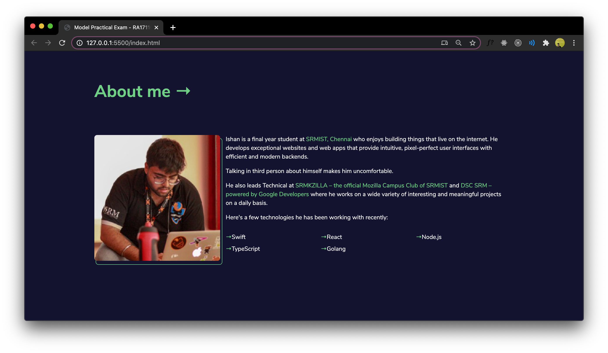

    

My submission for the <b>Model Practical Examination</b> of <b>15IT304J - Web Programming</b> 🎉

crafted with &hearts; by Ishan Chhabra

    

## 🙏 Author

**Web**: [Ishan Chhabra](https://ishanchhabra.com)\
**Twitter**: [@chh_abracadabra](https://twitter.com/chh_abracadabra)\
**Medium**: [@chh_abracadabra](https://medium.com/@chh_abracadabra)

## 📜 License

`mpe-009` is available under the MIT license. See the LICENSE file for more info.
